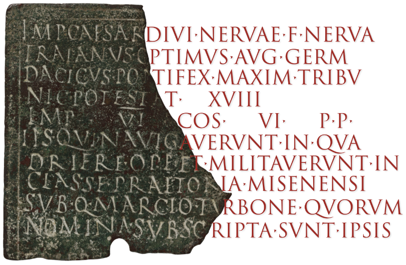
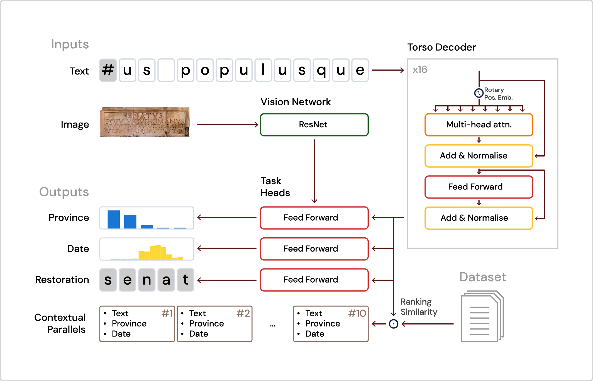

<p align="center" style="margin-bottom: 1em;">
  
</p>

# Contextualising ancient texts with generative neural networks

Yannis Assael<sup>1,\*</sup>, Thea Sommerschield<sup>2,\*</sup>, Alison Cooley<sup>3</sup>, Brendan Shillingford<sup>1</sup>, John Pavlopoulos<sup>4</sup>, Priyanka Suresh<sup>1</sup>, Bailey Herms<sup>5</sup>, Justin Grayston<sup>5</sup>, Benjamin Maynard<sup>5</sup>, Nicholas Dietrich<sup>1</sup>, Robbe Wulgaert<sup>6</sup>, Jonathan Prag<sup>7</sup>, Alex Mullen<sup>2</sup>, Shakir Mohamed<sup>1</sup>

<sup>1</sup> Google DeepMind<br>
<sup>2</sup> University of Nottingham, UK<br>
<sup>3</sup> University of Warwick, UK<br>
<sup>4</sup> Athens University of Economics and Business, Greece<br>
<sup>5</sup> Google<br>
<sup>6</sup> Sint-Lievenscollege, Belgium<br>
<sup>7</sup> University of Oxford, UK

<sup>\*</sup>Authors contributed equally to this work.

---

<summary><b>Citation</b></summary>
<p>
When using any of the source code or outputs of this project, please cite:

```
@article{asssome2025contextualising,
  title={Contextualising ancient texts with generative neural networks},
  author={Assael*, Yannis and Sommerschield*, Thea and Cooley, Alison and Pavlopoulos, John and Shillingford, Brendan and Herms, Bailey and Suresh, Priyanka and Maynard, Benjamin and Grayston, Justin and Wulgaert, Robbe and Prag, Jonathan and Mullen, Alex and Mohamed, Shakir},
  journal={Nature},
  volume={643},
  number={8073},
  year={2025},
  publisher={Nature Publishing}
}
```
</p>

---

<a href="https://colab.research.google.com/github/google-deepmind/predictingthepast/blob/master/colabs/inference.ipynb" target="_parent"></a>

Human history is born in writing. Inscriptions, among the earliest written
forms, offer direct insights into the thought, language, and history of ancient
civilisations. Historians capture these insights by identifying parallels -
inscriptions with shared phrasing, function, or cultural setting - to enable the
contextualisation of texts within broader historical frameworks, and perform key
tasks such as restoration and geographical or chronological attribution.
However, current digital methods are restricted to literal matches and narrow
historical scopes. We introduce Aeneas, the first generative neural network for
contextualising ancient texts. Aeneas retrieves textual and contextual
parallels, leverages visual inputs, handles arbitrary-length text restoration,
and advances the state-of-the-art in key tasks.

<p align="center">
  <br>
  <em>Fragment of a bronze military diploma from Sardinia, issued by the Emperor
  Trajan to a sailor on a warship. 113/14 CE (CIL XVI, 60, The Metropolitan
  Museum of Art, Public Domain).</em>
</p>

To evaluate its impact, we conduct the largest Historian-AI study to date, with
historians considering Aeneas’ retrieved parallels useful research starting
points in 90% of cases, improving their confidence in key tasks by 44%.
Restoration and geographical attribution tasks yielded superior results when
historians were paired with Aeneas, outperforming both humans and AI alone. For
dating, Aeneas achieved a 13-year distance from ground-truth ranges. We
demonstrate Aeneas’ contribution to historical workflows through analysis of key
traits in the *Res Gestae Divi Augusti*, the most renowned Roman inscription,
showing how integrating Science and Humanities can create transformative tools
to assist historians and advance our understanding of the past.

<p align="center">
  <br>
  <em>Given the image and textual transcription of an inscription (with damaged
sections of unknown-length marked with the "#" character), Aeneas uses a
transformer-based decoder, the "torso", to process the text. Specialised
networks, called "heads", handle character restoration, date attribution, and
geographical attribution (the latter also incorporating visual features). The
torso's intermediate representations are merged into a unified,
historically-enriched embedding to retrieve similar inscriptions from the LED,
ranked by relevance.</em>
</p>

## References

-   [Nature article](https://www.nature.com/articles/s41586-025-09292-5)
-   [Google DeepMind blog](https://deepmind.google/discover/blog/aeneas-transforms-how-historians-connect-the-past)
-   [Aeneas in the classroom](https://www.robbewulgaert.be/education/predicting-the-past-aeneas)

## Aeneas Inference Online

To aid further research in the field we created an online interactive python
notebook, where researchers can query one of our trained models to get text
restorations, visualise attention weights, and more.

-   [Aeneas Interactive Interface](https://predictingthepast.com/)
-   [Google Colab for using Aeneas for your research](https://colab.sandbox.google.com/github/google-deepmind/predictingthepast/blob/main/colabs/inference.ipynb)

## Aeneas Inference Offline

Advanced users who want to perform inference using the trained model may want
to do so manually using the `predictingthepast` library directly.

First, to install the `predictingthepast` library and its dependencies, run:

```sh
pip install .
```

Then, download the model files.

### Latin Model
```sh
curl --output aeneas_117149994_2.pkl \
    https://storage.googleapis.com/ithaca-resources/models/aeneas_117149994_2.pkl
curl --output led.json \
    https://storage.googleapis.com/ithaca-resources/models/led.json
curl --output led_emb_xid117149994.pkl \
    https://storage.googleapis.com/ithaca-resources/models/led_emb_xid117149994.pkl
```

### Ancient Greek Model
```sh
curl --output ithaca_153143996_2.pkl \
    https://storage.googleapis.com/ithaca-resources/models/ithaca_153143996_2.pkl
curl --output iphi.json \
    https://storage.googleapis.com/ithaca-resources/models/iphi.json
curl --output iphi_emb_xid153143996.pkl \
    https://storage.googleapis.com/ithaca-resources/models/iphi_emb_xid153143996.pkl
```

### Inference Example
An example of using the library can be run via:

```sh
python inference_example.py \
    --input_file="example_input.txt" \
    --checkpoint_path="aeneas_117149994_2.pkl" \
    --dataset_path="led.json" \
    --retrieval_path="led_emb_xid117149994.pkl" \
    --language="latin"
```

This will run restoration and attribution on the text in `example_input.txt`.

To run it with different input text, use the `--input` argument:
```sh
python inference_example.py \
    --input="..." \
    --checkpoint_path="aeneas_117149994_2.pkl" \
    --dataset_path="led.json" \
    --retrieval_path="led_emb_xid117149994.pkl" \
    --language="latin"
```

Or use text in a UTF-8 encoded text file:
```sh
python inference_example.py \
    --input_file="some_other_input_file.txt" \
    --checkpoint_path="aeneas_117149994_2.pkl" \
    --dataset_path="led.json" \
    --retrieval_path="led_emb_xid117149994.pkl" \
    --language="latin"
```

The restoration or attribution JSON can be saved to a file:
```sh
python inference_example.py \
    --input_file="example_input.txt" \
    --checkpoint_path="aeneas_117149994_2.pkl" \
    --dataset_path="led.json" \
    --retrieval_path="led_emb_xid117149994.pkl" \
    --language="latin" \
    --attribute_json="attribute.json" \
    --restore_json="restore.json"
```

For full help, run:
```sh
python inference_example.py --help
```

## Dataset Generation

For Latin, Aeneas was trained on data from:

*   **Epigraphic Database Roma (EDR)**[^1]: Made available pursuant to a
    Creative Commons Attribution 4.0 International License (CC-BY) on
    [Zenodo](https://zenodo.org/records/3575495). EDR is also available at
    [edr-edr.it](http://edr-edr.it).
*   **Epigraphic Database Heidelberg (EDH)**[^2]: Made available pursuant to a
    Creative Commons Attribution-ShareAlike 4.0 International License
    (CC-BY-SA) on [Zenodo](https://zenodo.org/records/3575155). EDH is also
    available at [edh.ub.uni-heidelberg.de](https://edh.ub.uni-heidelberg.de/).
*   **ETL repository for Epigraphic Database Clauss Slaby (EDCS\_ETL)**[^3]:
    Made available pursuant to a Creative Commons Attribution 4.0
    International License (CC-BY) on
    [Zenodo](https://zenodo.org/records/7072337). EDCS\_ETL is also available
    at [manfredclauss.de](http://www.manfredclauss.de/) and
    [github.com/sdam-au/EDCS\_ETL](https://github.com/sdam-au/EDCS_ETL).

For ancient Greek, Aeneas was trained on [Searchable Greek
Inscriptions](https://inscriptions.packhum.org/) of The Packard Humanities
Institute. The processed version is available at: [I.PHI
dataset](https://github.com/sommerschield/iphi).

[^1]: Silvio Panciera, Giuseppe Camodeca, Giovanni Cecconi, Silvia Orlandi,
    Lanfranco Fabriani, & Silvia Evangelisti. (2019). EDR - Epigraphic
    Database Roma EpiDoc files \[Data set\]. Zenodo.
[^2]: James M.S. Cowey, Francisca Feraudi-Gruénais, Brigitte Gräf, Frank
    Grieshaber, Regine Klar, & Jonas Osnabrügge. (2019). Epigraphic
    Database Heidelberg EpiDoc files \[Data set\]. Zenodo.
[^3]: Heřmánková, P. (2022). EDCS (2.0) \[Data set\]. Zenodo.

## Training Aeneas

See [`train/README.md`](train/README.md) for instructions.

## License & Disclaimer

Copyright 2025 Google LLC

All software is licensed under the Apache License, Version 2.0 (Apache 2.0);
you may not use this file except in compliance with the Apache 2.0 license.
You may obtain a copy of the Apache 2.0 license at:
https://www.apache.org/licenses/LICENSE-2.0

All other materials are licensed under the Creative Commons Attribution 4.0
International License (CC-BY). You may obtain a copy of the CC-BY license at:
https://creativecommons.org/licenses/by/4.0/legalcode

The dataset contains modified data from the Epigraphic Database Heidelberg
dataset. That data is licensed under the Creative Commons
Attribution-ShareAlike 4.0 International License (CC-BY-SA). You may
obtain a copy of the CC-BY-SA license at:
https://creativecommons.org/licenses/by-sa/4.0/legalcode.en

Unless required by applicable law or agreed to in writing, all software and
materials distributed here under the Apache 2.0, CC-BY-SA or CC-BY licenses
are distributed on an "AS IS" BASIS, WITHOUT WARRANTIES OR CONDITIONS OF ANY
KIND, either express or implied. See the licenses for the specific language
governing permissions and limitations under those licenses.

This is not an official Google product.
